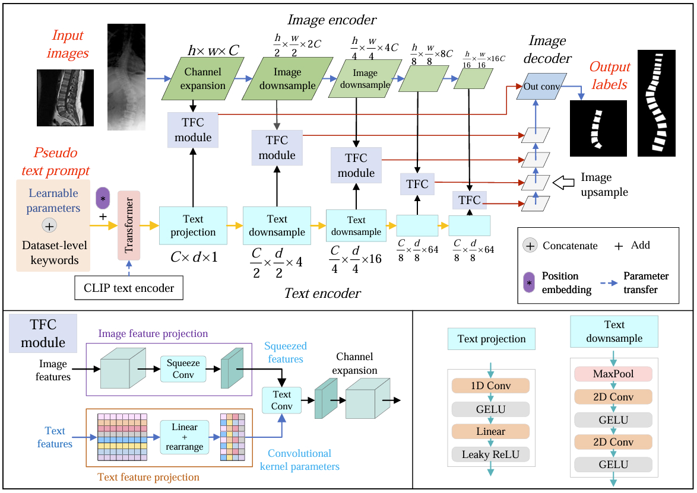

# ITSymNet

This repo is an implementation of the paper: Learning Pseudo Text Prompt for Improved Vertebrae Segmentation.

The detailed structure of the ITSymNet model is shown in the following figure:

<p align="center">
  
</p>

## Dataset

|   Dataset   |                        Download                         | Comment                                                 |
| :---------: | :-----------------------------------------------------: | ------------------------------------------------------- |
| Spineweb-16 |    [Link](https://aasce19.grand-challenge.org/Home/)    | Train and val: random split, Test: official split       |
|  Composite  | [Link](https://data.mendeley.com/datasets/k3b363f3vz/2) | Random split                                            |

Please prepare the dataset in the following format to facilitate the use of the code:

```angular2html
├── datasets
   ├── Spineweb-16
   │   ├── image
   |   |   ├── train
   |   |   ├── val
   |   |   └── test
   │   └── mask
   |       ├── train
   |       ├── val
   |       └── test
   |
   └── Composite
       ├── image
       ......
```
## Parameter preparation

Please [download](https://openaipublic.azureedge.net/clip/models/5806e77cd80f8b59890b7e101eabd078d9fb84e6937f9e85e4ecb61988df416f/ViT-B-16.pt) the pre-training parameters for the [CLIP](https://proceedings.mlr.press/v139/radford21a) model to the /model/ITSymNet/text_part/CLIP folder.

## Train model

```bash
python train.py
```


## Requirements

+ CUDA/CUDNN
+ pytorch>=1.7.1
+ torchvision>=0.8.2
